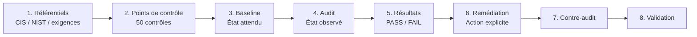
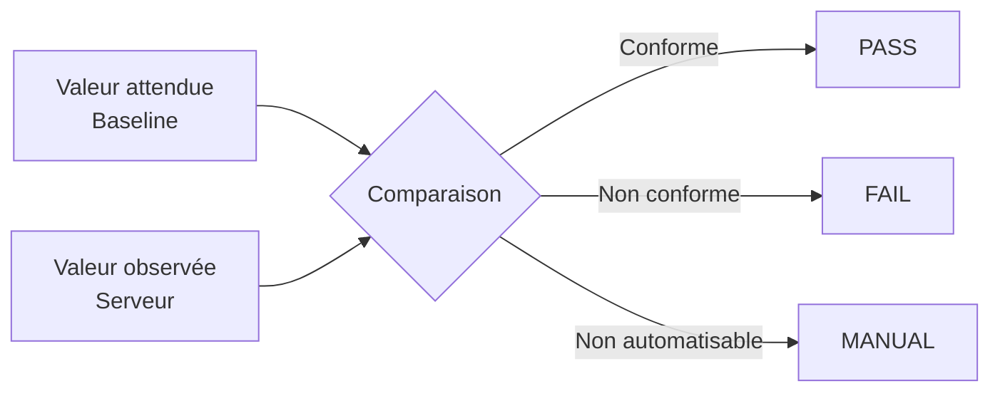
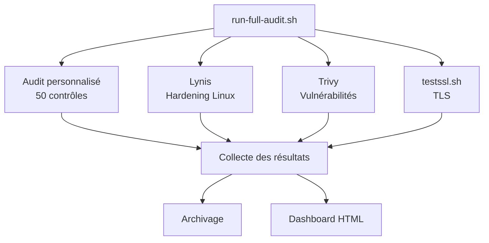
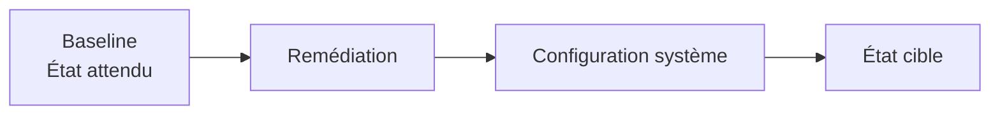
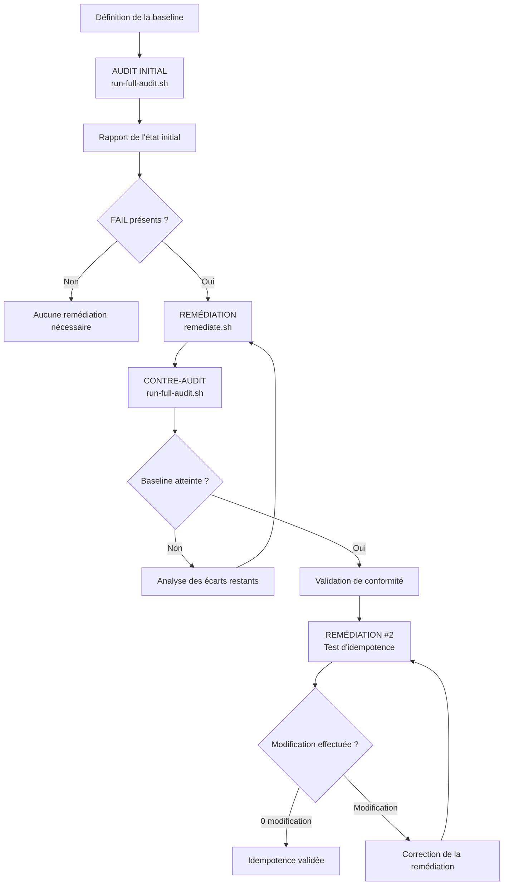

# Stratégie d'audit et de mise en conformité

## 1. Objectif

Ce projet met en place une stratégie d'audit et de mise en conformité d'un serveur **Debian 13 hébergeant Nginx**.

La démarche repose sur quatre éléments distincts :

1. définir les exigences de sécurité ;
2. traduire ces exigences en points de contrôle ;
3. auditer le serveur sans le modifier ;
4. appliquer séparément une remédiation puis effectuer un contre-audit.

L'objectif est de pouvoir mesurer l'écart entre :

```text
ÉTAT ATTENDU
défini dans la baseline

        et

ÉTAT RÉEL
observé sur le serveur
```

---

# 2. Vue générale de la stratégie

La stratégie complète peut être représentée simplement ainsi :



La chaîne principale est donc :

```text
RÉFÉRENTIELS
     │
     ▼
50 POINTS DE CONTRÔLE
     │
     ▼
BASELINE
"Que doit-on obtenir ?"
     │
     ▼
AUDIT
"Quel est l'état actuel ?"
     │
     ▼
PASS / FAIL
     │
     ▼
REMÉDIATION
"Corriger les écarts"
     │
     ▼
CONTRE-AUDIT
"Les écarts ont-ils disparu ?"
     │
     ▼
VALIDATION
```

> **Important : l'audit et la remédiation sont deux opérations indépendantes.**
>
> Un audit ne déclenche jamais automatiquement une remédiation.

---

# 3. Étape 1 — Référentiels

La première étape consiste à identifier les exigences de sécurité pertinentes pour le système étudié.

Le projet s'appuie notamment sur :

- CIS Benchmarks ;
- NIST SP 800 ;
- les exigences réglementaires ou organisationnelles applicables ;
- les bonnes pratiques de sécurisation Linux et Nginx retenues pour le projet.

Ces référentiels ne sont pas exécutables directement.

Ils servent à déterminer **ce qui doit être contrôlé**.

```text
Référentiel
     │
     │ sélection d'une exigence pertinente
     ▼
Exigence technique
     │
     │ traduction en condition vérifiable
     ▼
Point de contrôle
```

---

# 4. Étape 2 — Les points de contrôle

Une exigence retenue est traduite en un **point de contrôle technique**.

Le projet contient **50 contrôles**, répartis en cinq domaines :

| Domaine | Contrôles |
|---|---:|
| Système / noyau / comptes | 01–10 |
| Réseau | 11–20 |
| Stockage / permissions | 21–30 |
| Nginx / TLS / services | 31–40 |
| Paquets / mises à jour | 41–50 |

Un point de contrôle définit principalement :

```text
┌─────────────────────────────────────┐
│ POINT DE CONTRÔLE                   │
├─────────────────────────────────────┤
│ Numéro                              │
│ Référence                           │
│ Objectif                            │
│ Condition à vérifier                │
│ Valeur attendue                     │
│ Méthode de collecte                 │
│ Résultat PASS / FAIL / MANUAL       │
└─────────────────────────────────────┘
```

### Exemple

On souhaite limiter les ports TCP exposés par le serveur.

Le point de contrôle consiste à vérifier :

```text
Les ports TCP actuellement en écoute
doivent appartenir à la liste des
ports autorisés.
```

La valeur exacte des ports autorisés n'est pas codée directement dans le contrôle.

Elle provient de la **baseline**.

---

# 5. Étape 3 — La baseline

La baseline représente **l'état attendu du serveur**.

Elle est définie dans :

```text
config/baseline.conf
```

Par exemple :

```bash
ALLOWED_TCP_PORTS="22 80 443"
```

La baseline indique ici :

```text
Ports TCP autorisés
        │
        ├── 22
        ├── 80
        └── 443
```

Le contrôle réseau peut alors comparer :

```text
       BASELINE
       22 80 443
           │
           ▼
      COMPARAISON
           ▲
           │
       SERVEUR
     ports observés
```

La baseline définit donc **la politique**.

Le script de contrôle définit **la manière de vérifier cette politique**.

Le fonctionnement détaillé et les différentes variantes de baseline sont décrits dans :

[Documentation de la baseline](baseline.md)

---

# 6. Étape 4 — Audit

L'audit récupère l'état réel du serveur et le compare aux conditions définies.

L'audit principal est exécuté avec :

```bash
sudo ./audit/audit.sh
```

Pour chaque contrôle :



### PASS

```text
État observé = état attendu
```

### FAIL

```text
État observé ≠ état attendu
```

### MANUAL

Le contrôle nécessite une vérification humaine.

Dans la baseline technique actuellement utilisée, l'objectif est cependant d'automatiser les **50 contrôles**.

---

# 7. Exemple complet d'un contrôle

Prenons :

```bash
ALLOWED_TCP_PORTS="22 80 443"
```

Le serveur expose :

```text
22
80
443
```

Le contrôle effectue :

```text
        BASELINE
       22 80 443
           │
           ▼
      ┌─────────┐
      │ CONTRÔLE│
      └─────────┘
           ▲
           │
       22 80 443
        SERVEUR
```

Aucun port supplémentaire n'est détecté.

Résultat :

```text
PASS
```

Si un service est ensuite démarré sur le port `8080` :

```text
        BASELINE
       22 80 443
           │
           ▼
      ┌─────────┐
      │ CONTRÔLE│
      └─────────┘
           ▲
           │
    22 80 443 8080
        SERVEUR
```

Le port `8080` n'appartient pas à la liste autorisée.

Résultat :

```text
FAIL
```

Le rôle de l'audit s'arrête ici.

**Il détecte et rapporte l'écart. Il ne ferme pas le port 8080.**

---

# 8. Audit complet

La commande :

```bash
sudo ./audit/run-full-audit.sh
```

permet d'exécuter l'ensemble des outils de vérification.

Son fonctionnement est :



`run-full-audit.sh` effectue donc :

```text
                 run-full-audit.sh
                         │
       ┌─────────────────┼─────────────────┐
       │                 │                 │
       ▼                 ▼                 ▼
 Audit custom          Lynis             Trivy
       │
       └───────────────────────┐
                               │
                         testssl.sh
                               │
       ┌───────────────────────┘
       ▼
 Collecte des résultats
       │
       ├── historique
       └── dashboard HTML
```

## Ce que `run-full-audit.sh` ne fait pas

Il ne lance pas :

```text
remediation/remediate.sh
```

et ne lance pas les modules de :

```text
remediation/modules/
```

Il **n'applique donc aucune correction destinée à rendre le serveur conforme à la baseline**.

Les outils exécutés peuvent créer leurs fichiers de travail, journaux, rapports ou bases de données, mais cela est distinct d'une opération de mise en conformité.

---

# 9. Séparation audit / remédiation

Cette séparation est volontaire.

```text
┌─────────────────────────┐
│         AUDIT           │
│                         │
│ Observe                 │
│ Compare                 │
│ Détecte                 │
│ Rapporte                │
│                         │
│ NE REMÉDIE PAS          │
└────────────┬────────────┘
             │
             │ résultats
             ▼
        PASS / FAIL
             │
             │ décision explicite
             ▼
┌─────────────────────────┐
│      REMÉDIATION        │
│                         │
│ Modifie                 │
│ Corrige                 │
│ Configure               │
│ Fait converger          │
└─────────────────────────┘
```

Cette architecture évite qu'un audit modifie le système qu'il est justement en train d'évaluer.

Elle permet également de conserver une preuve de l'état initial avant toute correction.

---

# 10. Étape 5 — Remédiation

La remédiation doit être déclenchée explicitement :

```bash
sudo ./remediation/remediate.sh
```

Son rôle est différent de celui de l'audit.

```text
AUDIT
"Est-ce conforme ?"

        ≠

REMÉDIATION
"Rendre conforme"
```

La remédiation lit également la baseline afin de connaître l'état à atteindre.



Les corrections sont organisées par domaine dans :

```text
remediation/modules/
```

La remédiation est protégée afin de ne pouvoir être appliquée qu'au système prévu par le projet.

---

# 11. Étape 6 — Contre-audit

Une fois la remédiation terminée, l'audit est exécuté une seconde fois.

```text
AVANT
46 PASS
4 FAIL

       │
       ▼

REMÉDIATION

       │
       ▼

APRÈS
Nouvel audit
```

Le contre-audit utilise **exactement les mêmes points de contrôle et la même baseline**.

On ne change donc pas les règles entre l'audit initial et le contrôle final.

Cela permet de comparer objectivement :

```text
État initial
     VS
État après remédiation
```

---

# 12. Workflow complet

Le workflow réel du projet est donc :



En version simplifiée :

```text
        1
  DÉFINIR BASELINE
        │
        ▼
        2
   AUDIT INITIAL
        │
        ▼
  RAPPORT PASS/FAIL
        │
        ▼
        3
   REMÉDIATION
        │
        ▼
        4
   CONTRE-AUDIT
        │
        ▼
  CONFORME ?
    │       │
   NON     OUI
    │       │
    └──►    ▼
          TEST
       IDEMPOTENCE
            │
            ▼
      0 MODIFICATION
            │
            ▼
         VALIDÉ
```

---

# 13. Idempotence

Obtenir un audit conforme ne suffit pas.

La remédiation doit également être **idempotente**.

Cela signifie qu'une nouvelle exécution sur un système déjà conforme ne doit pas provoquer de modification inutile.

Le test est :

```text
Remédiation #1
      │
      ▼
Mise en conformité
      │
      ▼
Contre-audit
      │
      ▼
Serveur conforme
      │
      ▼
Remédiation #2
      │
      ▼
0 modification
```

Si la deuxième exécution modifie encore le serveur alors que celui-ci est déjà conforme, la remédiation doit être analysée.

---

# 14. Rôle des outils complémentaires

Les différents outils ne mesurent pas exactement la même chose.

| Outil | Question principale |
|---|---|
| Audit custom | Le serveur respecte-t-il notre baseline ? |
| Lynis | Quel est le niveau général de durcissement Linux ? |
| Trivy | Quelles vulnérabilités connues affectent les composants installés ? |
| testssl.sh | Quelle configuration TLS est réellement exposée ? |

Ils sont donc complémentaires.

```text
                    SERVEUR
                       │
       ┌───────────────┼───────────────┐
       │               │               │
       ▼               ▼               ▼
 AUDIT CUSTOM         LYNIS           TRIVY
       │               │               │
  Conformité       Hardening        CVE connues
       │               │               │
       └───────────────┬───────────────┘
                       │
                       ▼
                   testssl.sh
                       │
                       ▼
                  Exposition TLS
                       │
                       ▼
               RAPPORT CONSOLIDÉ
```

Un résultat `PASS` dans l'audit personnalisé ne signifie donc pas qu'aucune vulnérabilité n'existe.

Il signifie que **la condition définie dans la baseline est respectée**.

---

# 15. Génération et conservation des résultats

Les résultats produits par :

```bash
sudo ./audit/run-full-audit.sh
```

sont centralisés dans :

```text
audit/reports/
```

Le dernier audit est disponible dans :

```text
audit/reports/latest/
```

Les exécutions précédentes sont archivées dans :

```text
audit/reports/history/
```

Le dashboard HTML fournit une vue synthétique tandis que les sorties originales sont conservées comme éléments de preuve.

---

# 16. Résumé

La stratégie repose finalement sur trois responsabilités clairement séparées :

```text
┌──────────────────────┐
│       BASELINE       │
│                      │
│ Définit ce qui       │
│ doit être obtenu     │
└──────────┬───────────┘
           │
           ▼
┌──────────────────────┐
│        AUDIT         │
│                      │
│ Observe et compare   │
│ sans remédier        │
└──────────┬───────────┘
           │
           ▼
       PASS / FAIL
           │
           ▼
┌──────────────────────┐
│     REMÉDIATION      │
│                      │
│ Corrige les écarts   │
│ explicitement        │
└──────────┬───────────┘
           │
           ▼
┌──────────────────────┐
│    CONTRE-AUDIT      │
│                      │
│ Vérifie le nouvel    │
│ état du serveur      │
└──────────────────────┘
```

Le principe essentiel est donc :

> **La baseline définit. L'audit observe. La remédiation modifie. Le contre-audit vérifie.**

Ces opérations restent volontairement séparées afin de garantir la lisibilité, la traçabilité et la reproductibilité du processus de conformité.