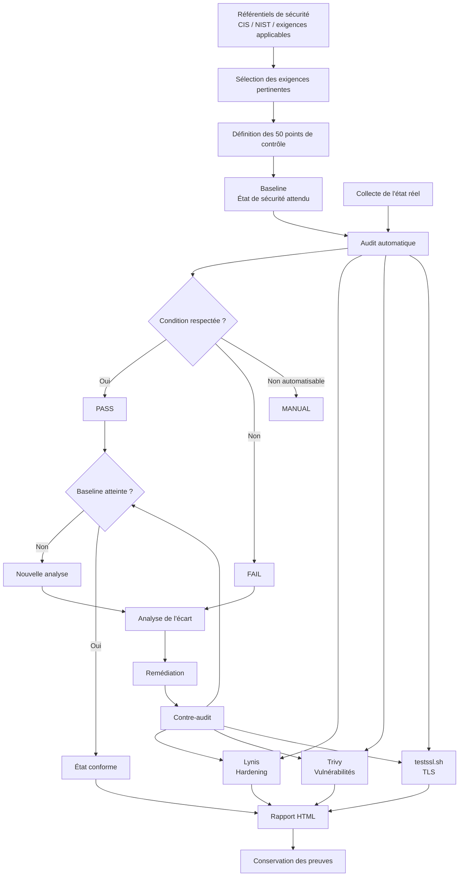
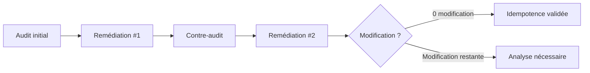

# Stratégie d'audit et de mise en conformité

## 1. Objectif

L'objectif est d'évaluer puis de mettre en conformité un serveur **Debian 13 hébergeant Nginx en HTTPS**.

La stratégie repose sur une chaîne de conformité :

```text
Référentiels
    ↓
Points de contrôle
    ↓
Baseline
    ↓
Audit
    ↓
Remédiation
    ↓
Contre-audit
    ↓
Validation
```

L'audit personnalisé constitue le mécanisme principal de vérification de la baseline.

Des outils complémentaires tels que **Lynis**, **Trivy** et **testssl.sh** permettent de confronter les résultats et d'étendre l'analyse.

---

## 2. Schéma de la stratégie



---

## 3. Définition d'un point de contrôle

Un point de contrôle représente une exigence technique vérifiable.

Chaque contrôle possède plusieurs éléments :

```text
┌─────────────────────────────────────┐
│ Point de contrôle                   │
├─────────────────────────────────────┤
│ ID                                  │
│ Référence                           │
│ Objectif                            │
│ Valeur attendue / condition         │
│ Méthode de collecte                 │
│ Méthode de comparaison              │
│ Résultat                            │
│ Remédiation éventuelle              │
└─────────────────────────────────────┘
```

Exemple :

```text
ID        : 17
Référence : SC-8
Objectif  : imposer HTTPS
Condition : le port TCP 443 doit être en écoute
Collecte  : sockets TCP du système
Résultat  : PASS / FAIL
```

---

## 4. Organisation des contrôles

Les 50 contrôles sont répartis en cinq domaines.

| Domaine | Contrôles |
|---|---:|
| Système / noyau / comptes | 01–10 |
| Réseau | 11–20 |
| Stockage / permissions | 21–30 |
| Nginx / TLS / services | 31–40 |
| Paquets / mises à jour | 41–50 |

Cette organisation permet de couvrir plusieurs couches du serveur plutôt que de limiter l'audit à Nginx.

---

## 5. États d'un contrôle

Chaque contrôle peut produire trois états.

### PASS

La condition définie par la baseline est respectée.

```text
État observé = état attendu
```

### FAIL

La condition n'est pas respectée.

```text
État observé ≠ état attendu
```

Un `FAIL` constitue donc un écart par rapport à la baseline.

### MANUAL

Le contrôle nécessite une validation humaine lorsqu'il n'est pas possible de conclure automatiquement.

L'objectif de la baseline technique actuelle est toutefois d'automatiser les 50 contrôles.

---

## 6. Processus d'audit

### Étape 1 — Définition

Les exigences pertinentes sont sélectionnées puis traduites en conditions techniques.

### Étape 2 — Baseline

Les valeurs attendues sont centralisées dans :

```text
config/baseline.conf
```

### Étape 3 — Audit initial

L'état réel du serveur est collecté et comparé à la baseline.

```bash
sudo ./audit/audit.sh
```

### Étape 4 — Identification des écarts

Les contrôles non conformes apparaissent en `FAIL`.

### Étape 5 — Remédiation

Les modules de remédiation tentent de faire converger la machine vers l'état défini dans la baseline.

```bash
sudo ./remediation/remediate.sh
```

### Étape 6 — Contre-audit

Le même audit est exécuté après remédiation.

L'utilisation des mêmes contrôles avant et après modification permet de mesurer objectivement l'évolution de la conformité.

---

## 7. Idempotence

La remédiation doit être idempotente.

Une fois la machine dans l'état attendu, une nouvelle exécution ne doit pas provoquer de modifications inutiles.



Le scénario attendu est donc :

```text
Audit
  ↓
Remédiation
  ↓
Audit conforme
  ↓
Remédiation
  ↓
0 modification
```

---

## 8. Validation complémentaire

L'audit personnalisé répond à la question :

> Le système respecte-t-il la baseline définie pour ce projet ?

Des outils complémentaires répondent à d'autres problématiques.

### Lynis

Analyse générale du durcissement Linux.

### Trivy

Recherche de vulnérabilités connues dans les composants installés.

### testssl.sh

Analyse du comportement TLS réellement exposé par Nginx.

Ils ne remplacent donc pas les 50 contrôles.

```text
                    Serveur
                       │
        ┌──────────────┼──────────────┐
        ▼              ▼              ▼
 Audit baseline      Trivy         testssl.sh
        │              │              │
 Conformité       Vulnérabilités      TLS
        │              │              │
        └──────────────┼──────────────┘
                       ▼
                     Lynis
                       │
                       ▼
               Analyse consolidée
```

---

## 9. Production des preuves

L'audit complet est lancé avec :

```bash
sudo ./audit/run-full-audit.sh
```

Les résultats sont archivés afin de conserver :

- l'audit des 50 contrôles ;
- le résultat Lynis ;
- le résultat Trivy ;
- le résultat testssl.sh ;
- le rapport HTML consolidé.

Le dernier résultat est disponible dans :

```text
audit/reports/latest/
```

Les audits précédents sont conservés dans :

```text
audit/reports/history/
```

Cette organisation permet de conserver la traçabilité des contrôles effectués.